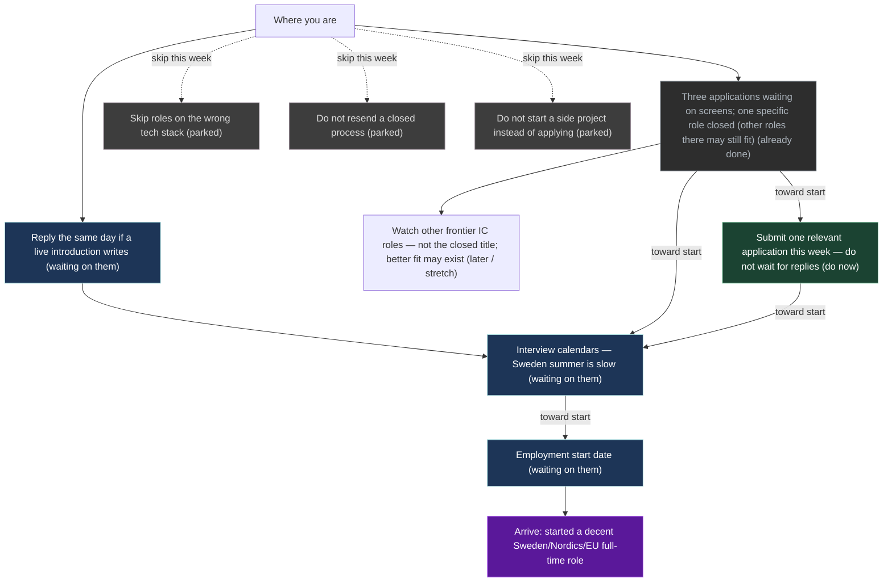

# Mission heading

Nightly rewrite (20:00 local). Numbers from `mission-map-graph`. No silent a/m/b overwrite.

**Do this now:** A4

Submit one relevant application this week — do not wait for replies. submit this week's pack (2026-08-17). Also: Reply the same day if a live introduction writes — nudge if silent 2026-08-20.

Detailed named graph (this machine only, not on git): [[UI/_private.Mission]].
Contact mail and posting URLs: `~/.grok/mission-maps/contacts.md`.

**Updated:** 2026-08-17T12:45:42+0530  
**On the path?** **on-path**

| | |
|--|--|
| **Arrive when** | started a decent Sweden/Nordics/EU full-time role |
| **Do this now** | A4 |
| **Weeks still expected** | 12.083333 |
| **Change since last snapshot** | 0.000000 |

This week's act is on the path to a start date.

## How to push

Do not sit on Sweden summer calendars. Ship one or two relevant applications per week while earlier ones are unanswered. Skip extra applications only on a day you have an interview. Skip wrong-stack roles, closed processes, and new side projects.

## Stages

Plain language. No S0/S1 codes. Emails are local-only.

| What | Status | Next follow-up | When |
|------|--------|----------------|------|
| Reply the same day if a live introduction writes | waiting on them | nudge if silent | 2026-08-20 |
| Three applications waiting on screens; one specific role closed (other roles there may still fit) | already done | do not resend the closed req; await the other three | — |
| Watch other frontier IC roles — not the closed title; better fit may exist | later / stretch | only new postings that match agents/infra; never resend the closed req | — |
| Submit one relevant application this week — do not wait for replies | do now | submit this week's pack | 2026-08-17 |
| Interview calendars — Sweden summer is slow | waiting on them | — | — |
| Employment start date | waiting on them | — | — |
| Skip roles on the wrong tech stack | parked | — | — |
| Do not resend a closed process | parked | — | — |
| Do not start a side project instead of applying | parked | — | — |

## Graph

Live JSON: `~/.grok/mission-maps/cash-path-now.json`. Brief: `~/.grok/mission-maps/cash-path-now.md`.

LLM may propose a stage. Human confirms. Do not treat this page as a destiny date.
