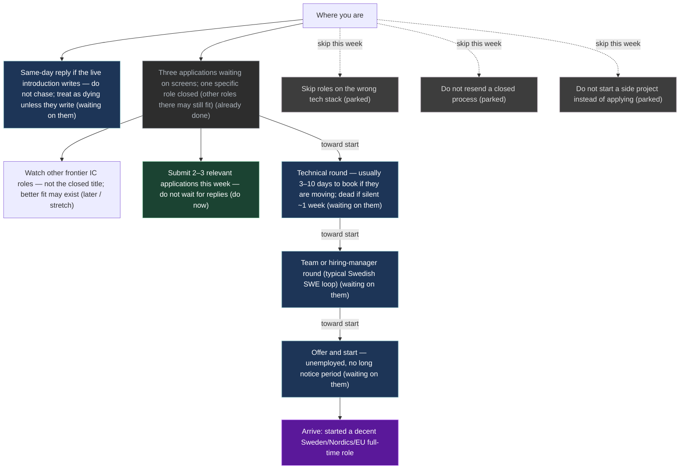

# Mission heading

Nightly rewrite (20:00 local). Numbers from `mission-map-graph`. No silent a/m/b overwrite.

**Do this now:** Submit 2–3 relevant applications (Fri 29) — do not wait for replies

Operator sitting: 2–3 live applies, then Sweden-return checklist, then one Grok Bot for hire-loop drafts. Same-day reply if the live introduction writes — do not chase; treat as dying unless they write. Named sitting: `private/career/2026-08-29-tomorrow.md`.

Detailed named graph (this machine only, not on git): [[UI/_private.Mission]].
Contact mail and posting URLs: `~/.grok/mission-maps/contacts.md`.

**Updated:** 2026-08-28  
**On the path?** **on-path**

| | |
|--|--|
| **Arrive when** | started a decent Sweden/Nordics/EU full-time role |
| **Do this now** | Submit 2–3 relevant applications (Fri 29) — do not wait for replies |
| **Live thread (intro already happened)** | 4.38 weeks typical |
| **If that thread dies** | you usually know within ~1 week of silence — not 12 weeks |
| **Longest remaining chain** | 4.283333 weeks (kernel; not a destiny date) |
| **Change since last snapshot** | 0.000000 |
| **This tick cosθ** | 0.0 |
| **This tick did** | operator plan for Fri 29: 2–3 applies + travel list + one Bot |
| **Named Do (still)** | 2–3 relevant applications this week |

This week's act is on the path to a start date.

## How to push

Keep shipping relevant applications until a calendar is booked (this sitting: 2–3, not spray). Same-day reply if a live introduction writes. Do not chase after ~1 week of silence — that is not a twelve-week wait. Drop extra applies only the day a calendar lands. Sweden still functions; the SWE funnel is distorted — [[Resources/ai-hiring-sweden]]. Do not wait for an AI recovery.

## How long (Sweden rounds)

Sweden SWE hiring (late August). Live intro was done; no calendar and no reply after thanks (14 Aug). Ghost signpost (silent ~1 week / no slot by 20 Aug) fired — treat that thread as dying unless they write. Remaining Wait chain is screens already sent → technical → team → start if they move. A new apply is parallel insurance and this week's Do; it is not stacked in front of a live interview. Unemployed start is often 1–4 weeks, not a 3-month notice.

## Stages

Plain language. No S0/S1 codes. Emails are local-only.

| What | Status | Next follow-up | When |
|------|--------|----------------|------|
| Same-day reply if the live introduction writes — do not chase; treat as dying unless they write | waiting on them | same-day reply only if they write — no extra nudge | — |
| Three applications waiting on screens; one specific role closed (other roles there may still fit) | already done | await screen (submitted) | — |
| Watch other frontier IC roles — not the closed title; better fit may exist | later / stretch | only new postings that match agents/infra; never resend the closed req | — |
| Submit 2–3 relevant applications this week — do not wait for replies | do now | live-check then submit (sitting) | 2026-08-29 |
| Technical round — usually 3–10 days to book if they are moving; dead if silent ~1 week | waiting on them | if a screen books, show up that day; if still silent by 29 Aug, treat remaining screens as dying too | — |
| Team or hiring-manager round (typical Swedish SWE loop) | waiting on them | — | — |
| Offer and start — unemployed, no long notice period | waiting on them | — | — |
| Skip roles on the wrong tech stack | parked | — | — |
| Do not resend a closed process | parked | — | — |
| Do not start a side project instead of applying | parked | — | — |

## Graph

Live JSON: `~/.grok/mission-maps/cash-path-now.json`. Brief: `~/.grok/mission-maps/cash-path-now.md`.

LLM may propose a stage. Human confirms. Do not treat this page as a destiny date.
