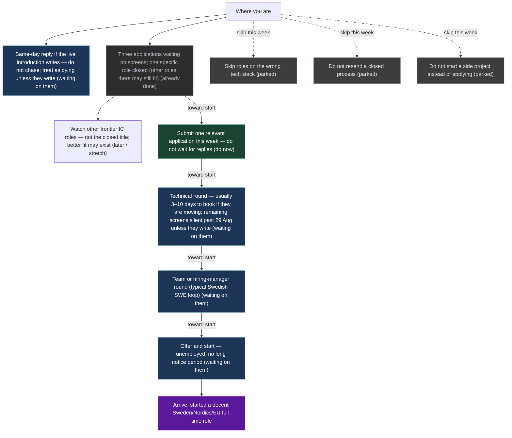

# Mission heading

Nightly rewrite (20:00 local). Numbers from `mission-map-graph`. No silent a/m/b overwrite.

**Do this now:** Submit one relevant application this week — do not wait for replies

Submit one relevant application this week — do not wait for replies. submit this week's pack (ready sitting) (2026-09-04). Also: Same-day reply if the live introduction writes — do not chase; treat as dying unless they write — same-day reply only if they write — no extra nudge.

Detailed named graph (this machine only, not on git): [[UI/_private.Mission]].
Contact mail and posting URLs: `~/.grok/mission-maps/contacts.md`.

**Updated:** 2026-08-31T23:53:32+0530  
**On the path?** **replan**

| | |
|--|--|
| **Arrive when** | started a decent Sweden/Nordics/EU full-time role |
| **Do this now** | Submit one relevant application this week — do not wait for replies |
| **Live thread (intro already happened)** | 4.38 weeks typical |
| **If that thread dies** | you usually know within ~1 week of silence — not 12 weeks |
| **Longest remaining chain** | 5.366667 weeks (kernel; not a destiny date) |
| **Change since last snapshot** | 1.083333 |
| **This tick cosθ** | 0.0 |
| **This tick did** | W36 replan: week apply still open; screens silent past 29 Aug; presence is not the pack |
| **Named Do (still)** | one relevant application this week |

Remaining T grew (delta_te=1.083333) after a DAG/band replan — still on û_G. Not a Park.

## How to push

Keep shipping one relevant application per week until a calendar is booked. Same-day reply if a live introduction writes. Do not chase after ~1 week of silence — that is not a twelve-week wait. Drop extra applies only the day a calendar lands. Presence already shipped this tick — do not open another site spike before the pack is in.

## How long (Sweden rounds)

Sweden SWE hiring (early September, week 36). Live intro: no calendar; same-day reply only if they write. Ghost signpost already fired. Remaining-screens silent-by-29-Aug signpost also fired — treat those waits as dying unless they write. This week's Do is a new apply; technical wait now sits behind that apply, not in front of a live interview. Unemployed start is often 1–4 weeks, not a 3-month notice.

## Stages

Plain language. No S0/S1 codes. Emails are local-only.

| What | Status | Next follow-up | When |
|------|--------|----------------|------|
| Same-day reply if the live introduction writes — do not chase; treat as dying unless they write | waiting on them | same-day reply only if they write — no extra nudge | — |
| Three applications waiting on screens; one specific role closed (other roles there may still fit) | already done | await screen (submitted) | — |
| Watch other frontier IC roles — not the closed title; better fit may exist | later / stretch | only new postings that match agents/infra; never resend the closed req | — |
| Submit one relevant application this week — do not wait for replies | do now | submit this week's pack (ready sitting) | 2026-09-04 |
| Technical round — usually 3–10 days to book if they are moving; remaining screens silent past 29 Aug unless they write | waiting on them | if a new apply books, show up that day; old screens: same-day reply only if they write — no extra nudge | — |
| Team or hiring-manager round (typical Swedish SWE loop) | waiting on them | — | — |
| Offer and start — unemployed, no long notice period | waiting on them | — | — |
| Skip roles on the wrong tech stack | parked | — | — |
| Do not resend a closed process | parked | — | — |
| Do not start a side project instead of applying | parked | — | — |

## Graph

Live JSON: `~/.grok/mission-maps/cash-path-now.json`. Brief: `~/.grok/mission-maps/cash-path-now.md`.

LLM may propose a stage. Human confirms. Do not treat this page as a destiny date.
