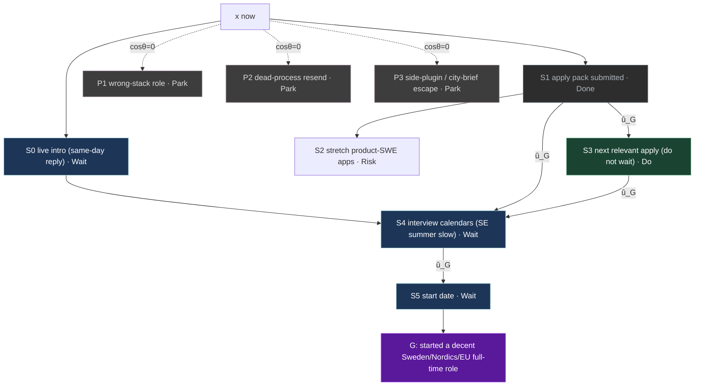

# Mission heading

Nightly rewrite (20:00 local). Numbers from `mission-map-graph`. No silent a/m/b overwrite.

**Do this now:** next relevant apply (do not wait)

next relevant apply (do not wait). submit this week's pack (2026-08-17). Also: live intro (same-day reply) — nudge if silent 2026-08-20.

Emails and posting URLs: local `~/.grok/mission-maps/contacts.md` (not this page).

**Updated:** 2026-08-17T12:29:25+0530  
**Verdict:** **on-path**

| Field | Value |
|-------|--------|
| **G** | started a decent Sweden/Nordics/EU full-time role |
| **heading** | on-path |
| **cosθ** | 1 |
| **next_do** | S3 |
| **critical** | S1 -> S3 -> S4 -> S5 |
| **residual** | S3 -> S4 -> S5 -> G |
| **path_te** (wk) | 12.083333 |
| **path_te_was** | 12.083333 |
| **delta_te** | 0.000000 |
| **completed** | — |
| **parked** | P1,P2,P3 |

Heading along û_G.

## Push rule

Do not sit on Sweden summer Wait. Ship 1–2 relevant applies per week while intros/packs are unanswered. Drop extra applies only the day a calendar lands. Spray / wrong-stack / dead resend stay Park.

## Key

Ids are handles. Follow-up stage is what to do next. Emails are local-only.

| id | class | what | follow-up | when |
|----|-------|------|-----------|------|
| S0 | Wait | live intro (same-day reply) | nudge if silent | 2026-08-20 |
| S1 | Done | apply pack submitted | await screen (submitted) | — |
| S2 | Risk | stretch product-SWE apps | — | — |
| S3 | Do | next relevant apply (do not wait) | submit this week's pack | 2026-08-17 |
| S4 | Wait | interview calendars (SE summer slow) | — | — |
| S5 | Wait | start date | — | — |
| P1 | Park | wrong-stack role | — | — |
| P2 | Park | dead-process resend | — | — |
| P3 | Park | side-plugin / city-brief escape | — | — |

## Graph

Live JSON: `~/.grok/mission-maps/cash-path-now.json`. Brief: `~/.grok/mission-maps/cash-path-now.md`.

LLM may propose a stage. Human confirms. Do not treat this page as a destiny date.
