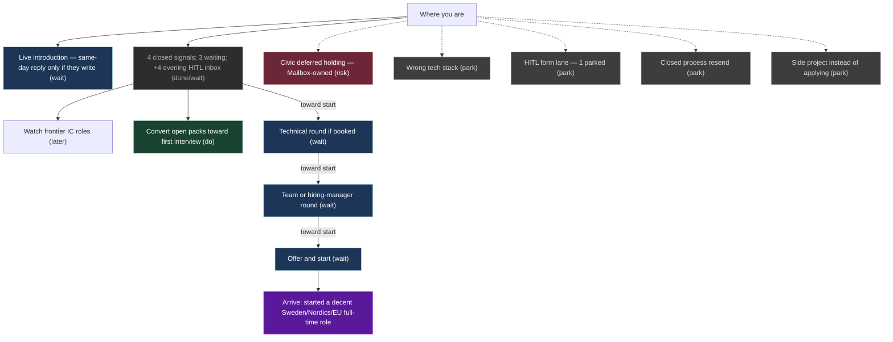

# Mission heading

Nightly rewrite (20:00 local). Numbers from `mission-map-graph`. No silent a/m/b overwrite.

**Do this now:** Wait on cash path — convert open applications toward a first interview; same-day reply only if a screen or live introduction writes. No new apply this tick unless the operator expands the hunt.

Follow through on waiting packs before opening new lanes. Do not chase silence after ~1 week — that thread is dying unless they write.

Detailed named graph (this machine only, not on git): [[UI/_private.Mission]].
Contact mail and posting URLs: `~/.grok/mission-maps/contacts.md`.

**Updated:** 2026-09-13T20:00:00+0530  
**Mode:** WAIT · **On the path?** **on-path** (G kept — attention → reply; pulse does not write G)

| | |
|--|--|
| **Arrive when** | started a decent Sweden/Nordics/EU full-time role |
| **Cash critical path** | Wait — **no Next Do** on new apply |
| **Do this now** | Convert waiting packs toward first interview — not volume spray; same-day reply only if they write |
| **Live thread (intro already happened)** | typical window still open |
| **If that thread dies** | you usually know within ~1 week of silence — not 12 weeks |
| **Week close (W37)** | **4** attention signals closed (3 paper + 1 post-screen) |
| **Still waiting (afternoon pulse)** | **3** |
| **Parked** | **1** (human-in-the-loop form lane) |
| **Interviews stored** | **0** |
| **Evening 13 Sep** | **+4** human-in-the-loop submits → inbox wait (not in afternoon pulse yet) |
| **This tick cosθ** | on-path (attention ≠ silence) |
| **Named Do (still)** | interview conversion on waiting packs |

Outcome source of truth: Kanithanj Desk + Ensembly ledger — Chief of Staff cites counts only; this Mission Brief owns next-Do. Hiring inbox: daily. Public git host aliases: laptop-1 / laptop-2 / mac-mini only.

This week's act is on the path to a start date.

## How to push

Sustain the apply habit that yields employer attention — declines still count as signal, not silence. Convert open applications toward a first booked interview before spraying more firms. Same-day reply if a live introduction or a new screen writes. Do not chase after ~1 week of silence.

## How long (Sweden rounds)

Sweden/Nordics software hiring (mid-Sep close). This week **4** attention signals closed (3 paper + 1 post-screen) — employer/Applicant Tracking System (ATS) attention, not silence. Afternoon pulse: **3** still waiting, **1** parked (human-in-the-loop form), **0** interviews stored. Evening 13 Sep added **+4** human-in-the-loop submits (inbox wait; outside afternoon pulse). Live intro: no calendar; same-day reply only if they write. Older silent screens: dying unless they write. Civic risk lane: deferred holding sent — Mailbox-owned, **no receipt**, not cash Next Do. Horizon non-Europe pack on disk — not G; do not spend this tick there. Unemployed start is often 1–4 weeks, not a 3-month notice.

## Stages

Plain language. No stage codes. Identifiers are local-only.

| What | Status | Next follow-up | When |
|------|--------|----------------|------|
| Same-day reply if the live introduction writes — do not chase; treat as dying unless they write | waiting on them | same-day reply only if they write — no extra nudge | — |
| Week close — 4 attention signals (3 paper + 1 post-screen); 3 still waiting; +4 evening human-in-the-loop submits in inbox wait | done / waiting | convert toward first interview; await remaining screens | — |
| Watch frontier individual-contributor roles — better fit may exist | later / stretch | only new postings that match; never resend closed processes | — |
| Convert waiting packs toward first interview — follow-through, not volume spray | do now | show up if a screen books; prep for technical/team rounds | — |
| Technical round — typical Swedish software loop | waiting on them | if a pack books, show up that day; same-day reply only if they write | — |
| Team or hiring-manager round | waiting on them | — | — |
| Offer and start — unemployed, no long notice period | waiting on them | — | — |
| Civic deferred holding — Mailbox-owned | risk / done | not cash Next Do; holding sent, no receipt | — |
| Skip roles on the wrong tech stack | parked | — | — |
| Human-in-the-loop form lane (1 parked) | parked | do not treat as work | — |
| Do not resend a closed process | parked | — | — |
| Do not start a side project instead of applying | parked | — | — |

## Graph

Live JSON: `~/.grok/mission-maps/cash-path-now.json`. Brief: `~/.grok/mission-maps/cash-path-now.md`.

LLM may propose a stage. Human confirms. Do not treat this page as a destiny date.
