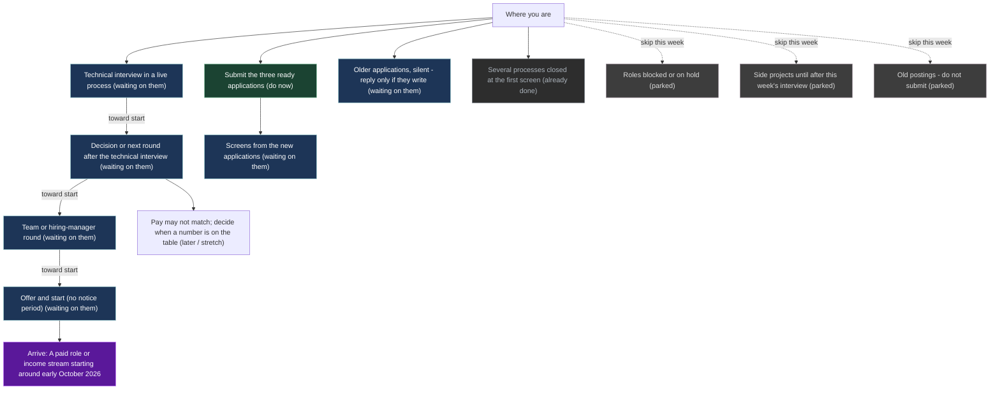

# Mission heading

Nightly rewrite (20:00 local). Numbers from `mission-map-graph`. No silent a/m/b overwrite.

**Do this now:** Submit the three ready applications

Submit the three ready applications. submit before the postings pass one week old (by 30 Sep). Also: Technical interview in a live process — attend Fri 2 Oct.

**Updated:** 2026-09-29T21:08:59+0200  
**On the path?** **on-path**

| | |
|--|--|
| **Arrive when** | A paid role or income stream starting around early October 2026 |
| **Do this now** | Submit the three ready applications |
| **Live thread (intro already happened)** | 4.69 weeks typical |
| **If that thread dies** | you usually know within ~1 week of silence — not 12 weeks |
| **Longest remaining chain** | 4.686667 weeks (kernel; not a destiny date) |
| **Change since last snapshot** | 0.000000 |
| **This tick alignment** | 1.0 |
| **This tick did** | Map rebuilt from the current state |
| **Named Do (still)** | Submit the three ready applications |

This week's act is on the path to a start date.

## How to push

Submit fresh postings the same week they appear. Reply the same day when a live process writes. Do not chase after about a week of silence. No side projects before this week's interview.

## How long (Sweden rounds)

One live process has a technical interview this week. Three fresh applications are ready to submit. Several older applications are silent and are treated as closed unless they write. Swedish processes usually take 1-3 weeks per round; an unemployed start can be 1-4 weeks after an offer.

## Stages

Plain language. No S0/S1 codes. Emails are local-only.

| What | Status | Next follow-up | When |
|------|--------|----------------|------|
| Submit the three ready applications | do now | submit before the postings pass one week old | by 30 Sep |
| Technical interview in a live process | waiting on them | attend | Fri 2 Oct |
| Decision or next round after the technical interview | waiting on them | reply the same day if they write | — |
| Team or hiring-manager round | waiting on them | — | — |
| Offer and start (no notice period) | waiting on them | — | — |
| Screens from the new applications | waiting on them | reply the same day if they write | — |
| Older applications, silent - reply only if they write | waiting on them | no nudge | — |
| Pay may not match; decide when a number is on the table | later / stretch | — | — |
| Several processes closed at the first screen | already done | — | — |
| Roles blocked or on hold | parked | — | — |
| Side projects until after this week's interview | parked | — | — |
| Old postings - do not submit | parked | — | — |

## Graph

```mermaid
flowchart TB
  x["Where you are"]
  G["Arrive: A paid role or income stream starting around early October 2026"]
  S3["Submit the three ready applications (do now)"]
  S0["Technical interview in a live process (waiting on them)"]
  S4["Decision or next round after the technical interview (waiting on them)"]
  S4b["Team or hiring-manager round (waiting on them)"]
  S5["Offer and start (no notice period) (waiting on them)"]
  S6["Screens from the new applications (waiting on them)"]
  S1["Older applications, silent - reply only if they write (waiting on them)"]
  R1["Pay may not match; decide when a number is on the table (later / stretch)"]
  D1["Several processes closed at the first screen (already done)"]
  P1["Roles blocked or on hold (parked)"]
  P2["Side projects until after this week's interview (parked)"]
  P3["Old postings - do not submit (parked)"]
  x --> S3
  x --> S0
  S0 -->|"toward start"| S4
  S4 -->|"toward start"| S4b
  S4b -->|"toward start"| S5
  S3 --> S6
  x --> S1
  S4 --> R1
  x --> D1
  x -.->|"skip this week"| P1
  x -.->|"skip this week"| P2
  x -.->|"skip this week"| P3
  S5 --> G
  classDef do fill:#1b4332,stroke:#95d5b2,color:#fff
  classDef wait fill:#1d3557,stroke:#a8dadc,color:#fff
  classDef park fill:#3d3d3d,stroke:#9a8c98,color:#ddd
  classDef done fill:#2d2d2d,stroke:#6c757d,color:#adb5bd
  classDef goal fill:#5a189a,stroke:#c77dff,color:#fff
  class G goal
  class S3 do
  class S0,S4,S4b,S5,S6,S1 wait
  class P1,P2,P3 park
  class D1 done
```

LLM may propose a stage. Human confirms. Do not treat this page as a destiny date.
