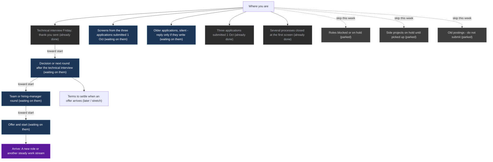

# Mission heading

Nightly rewrite (20:00 local). Numbers from `mission-map-graph`. No silent a/m/b overwrite.

**Do this now:** Do this now

No Do on the map.

**Updated:** 2026-10-04T20:10:22+0200  
**On the path?** **wait**

| | |
|--|--|
| **Arrive when** | A new role or another steady work stream |
| **Do this now** | Do this now |
| **Live thread (intro already happened)** | 4.27 weeks typical |
| **If that thread dies** | you usually know within ~1 week of silence — not 12 weeks |
| **Longest remaining chain** | 4.266667 weeks (kernel; not a destiny date) |
| **Change since last snapshot** | 0.000000 |
| **This tick alignment** | 1.0 |
| **This tick did** | Evening check — still waiting on a decision after Friday's interview thank-you |
| **Named Do (still)** | Reply the same day if a live process writes |

No self-vector. Signpost only; do not invent work.

## How to push

Reply the same day when a live process writes. Do not chase after about a week of silence. The technical interview is done and a thank-you went out; wait on the decision. Submit fresh postings the same week they appear.

## How long (Sweden rounds)

One live process finished its technical interview on Friday and a thank-you went out; still waiting on a decision (eta early next week). Three applications from 1 Oct are still waiting on first screens. Several older applications are silent and are treated as closed unless they write. Swedish processes usually take 1-3 weeks per round; a start can be 1-4 weeks after an offer.

## Stages

Plain language. No S0/S1 codes. Emails are local-only.

| What | Status | Next follow-up | When |
|------|--------|----------------|------|
| Technical interview Friday; thank-you sent | already done | done | Friday |
| Decision or next round after the technical interview | waiting on them | reply the same day if they write | — |
| Team or hiring-manager round | waiting on them | — | — |
| Offer and start | waiting on them | — | — |
| Screens from the three applications submitted 1 Oct | waiting on them | reply the same day if they write | — |
| Older applications, silent - reply only if they write | waiting on them | no nudge | — |
| Terms to settle when an offer arrives | later / stretch | — | — |
| Three applications submitted 1 Oct | already done | — | — |
| Several processes closed at the first screen | already done | — | — |
| Roles blocked or on hold | parked | — | — |
| Side projects on hold until picked up | parked | — | — |
| Old postings - do not submit | parked | — | — |

## Graph

```mermaid
flowchart TB
  x["Where you are"]
  G["Arrive: A new role or another steady work stream"]
  S0["Technical interview Friday; thank-you sent (already done)"]
  S4["Decision or next round after the technical interview (waiting on them)"]
  S4b["Team or hiring-manager round (waiting on them)"]
  S5["Offer and start (waiting on them)"]
  S6["Screens from the three applications submitted 1 Oct (waiting on them)"]
  S1["Older applications, silent - reply only if they write (waiting on them)"]
  R1["Terms to settle when an offer arrives (later / stretch)"]
  S3["Three applications submitted 1 Oct (already done)"]
  D1["Several processes closed at the first screen (already done)"]
  P1["Roles blocked or on hold (parked)"]
  P2["Side projects on hold until picked up (parked)"]
  P3["Old postings - do not submit (parked)"]
  x --> S0
  S0 -->|"toward start"| S4
  S4 -->|"toward start"| S4b
  S4b -->|"toward start"| S5
  x --> S6
  x --> S1
  S4 --> R1
  x --> S3
  x --> D1
  x -.->|"skip this week"| P1
  x -.->|"skip this week"| P2
  x -.->|"skip this week"| P3
  S5 --> G
  classDef do fill:#1b4332,stroke:#95d5b2,color:#fff
  classDef wait fill:#1d3557,stroke:#a8dadc,color:#fff
  classDef park fill:#3d3d3d,stroke:#9a8c98,color:#ddd
  classDef done fill:#2d2d2d,stroke:#6c757d,color:#adb5bd
  classDef goal fill:#5a189a,stroke:#c77dff,color:#fff
  class G goal
  class S4,S4b,S5,S6,S1 wait
  class P1,P2,P3 park
  class S0,S3,D1 done
```

LLM may propose a stage. Human confirms. Do not treat this page as a destiny date.
