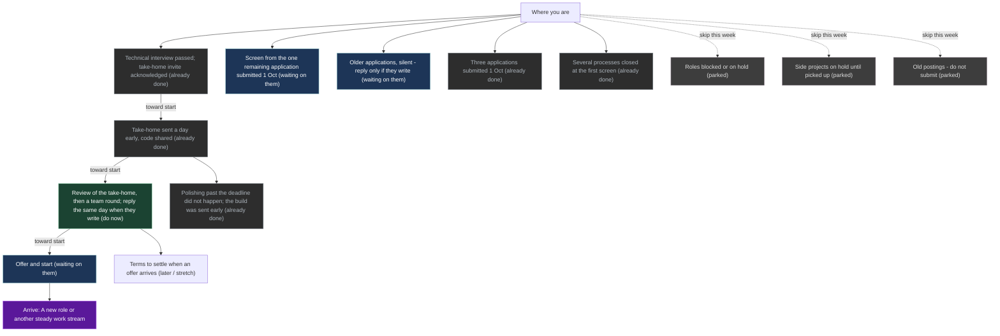

# Mission heading

Nightly rewrite (20:00 local). Numbers from `mission-map-graph`. No silent a/m/b overwrite.

**Do this now:** Review of the take-home, then a team round; reply the same day when they write

Review of the take-home, then a team round; reply the same day when they write. reply the same day; no nudge before about a week. Also: Screen from the one remaining application submitted 1 Oct — reply the same day if they write.

**Updated:** 2026-10-08T20:18:56+0200  
**On the path?** **on-path**

| | |
|--|--|
| **Arrive when** | A new role or another steady work stream |
| **Do this now** | Review of the take-home, then a team round; reply the same day when they write |
| **Live thread (intro already happened)** | 3.22 weeks typical |
| **If that thread dies** | you usually know within ~1 week of silence — not 12 weeks |
| **Longest remaining chain** | 3.216667 weeks (kernel; not a destiny date) |
| **Change since last snapshot** | -0.200000 |
| **This tick alignment** | 1.0 |
| **This tick did** | Evening check: the take-home was sent a day early and the code shared; one more application closed; no other replies |
| **Named Do (still)** | Reply the same day when the reviewers or the remaining application write |

Progress: completed R2,S4. Remaining T moved -0.200000.

## How to push

Reply the same day when a live process writes. Do not chase after about a week of silence. The take-home is sent; let the review run without extra polish or nudges. Submit fresh postings the same week they appear.

## How long (Sweden rounds)

The take-home for the live process was sent a day early and is now in review. One application from 1 Oct is still waiting on a first screen. Several older applications are silent and are treated as closed unless they write. Swedish processes usually take 1-3 weeks per round; a start can be 1-4 weeks after an offer.

## Stages

Plain language. No S0/S1 codes. Emails are local-only.

| What | Status | Next follow-up | When |
|------|--------|----------------|------|
| Technical interview passed; take-home invite acknowledged | already done | done | this week |
| Take-home sent a day early, code shared | already done | done | this week |
| Review of the take-home, then a team round; reply the same day when they write | do now | reply the same day; no nudge before about a week | — |
| Offer and start | waiting on them | — | — |
| Screen from the one remaining application submitted 1 Oct | waiting on them | reply the same day if they write | — |
| Older applications, silent - reply only if they write | waiting on them | no nudge | — |
| Terms to settle when an offer arrives | later / stretch | — | — |
| Polishing past the deadline did not happen; the build was sent early | already done | — | — |
| Three applications submitted 1 Oct | already done | — | — |
| Several processes closed at the first screen | already done | — | — |
| Roles blocked or on hold | parked | — | — |
| Side projects on hold until picked up | parked | — | — |
| Old postings - do not submit | parked | — | — |

## Graph

```mermaid
flowchart TB
  x["Where you are"]
  G["Arrive: A new role or another steady work stream"]
  S0["Technical interview passed; take-home invite acknowledged (already done)"]
  S4["Take-home sent a day early, code shared (already done)"]
  S4b["Review of the take-home, then a team round; reply the same day when they write (do now)"]
  S5["Offer and start (waiting on them)"]
  S6["Screen from the one remaining application submitted 1 Oct (waiting on them)"]
  S1["Older applications, silent - reply only if they write (waiting on them)"]
  R1["Terms to settle when an offer arrives (later / stretch)"]
  R2["Polishing past the deadline did not happen; the build was sent early (already done)"]
  S3["Three applications submitted 1 Oct (already done)"]
  D1["Several processes closed at the first screen (already done)"]
  P1["Roles blocked or on hold (parked)"]
  P2["Side projects on hold until picked up (parked)"]
  P3["Old postings - do not submit (parked)"]
  x --> S0
  S0 -->|"toward start"| S4
  S4 -->|"toward start"| S4b
  S4b -->|"toward start"| S5
  x --> S6
  x --> S1
  S4b --> R1
  S4 --> R2
  x --> S3
  x --> D1
  x -.->|"skip this week"| P1
  x -.->|"skip this week"| P2
  x -.->|"skip this week"| P3
  S5 --> G
  classDef do fill:#1b4332,stroke:#95d5b2,color:#fff
  classDef wait fill:#1d3557,stroke:#a8dadc,color:#fff
  classDef park fill:#3d3d3d,stroke:#9a8c98,color:#ddd
  classDef done fill:#2d2d2d,stroke:#6c757d,color:#adb5bd
  classDef goal fill:#5a189a,stroke:#c77dff,color:#fff
  class G goal
  class S4b do
  class S5,S6,S1 wait
  class P1,P2,P3 park
  class S0,S4,R2,S3,D1 done
```

LLM may propose a stage. Human confirms. Do not treat this page as a destiny date.
