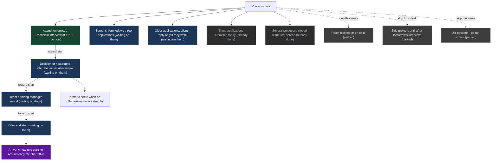

# Mission heading

Nightly rewrite (20:00 local). Numbers from `mission-map-graph`. No silent a/m/b overwrite.

**Do this now:** Attend tomorrow's technical interview at 11:00

Attend tomorrow's technical interview at 11:00. attend (tomorrow 11:00). Also: Decision or next round after the technical interview — reply the same day if they write.

**Updated:** 2026-10-01T20:04:08+0200  
**On the path?** **on-path**

| | |
|--|--|
| **Arrive when** | A new role starting around early October 2026 |
| **Do this now** | Attend tomorrow's technical interview at 11:00 |
| **Live thread (intro already happened)** | 4.32 weeks typical |
| **If that thread dies** | you usually know within ~1 week of silence — not 12 weeks |
| **Longest remaining chain** | 4.316667 weeks (kernel; not a destiny date) |
| **Change since last snapshot** | -0.370000 |
| **This tick alignment** | 1.0 |
| **This tick did** | Evening check — three applications submitted; next step is the interview |
| **Named Do (still)** | Attend tomorrow's technical interview at 11:00 |

Progress: completed S3. Remaining T moved -0.370000.

## How to push

Reply the same day when a live process writes. Do not chase after about a week of silence. Protect tomorrow morning for the technical interview. No side projects before that interview. Submit fresh postings the same week they appear.

## How long (Sweden rounds)

One live process has a technical interview tomorrow morning. Three applications were submitted today and are waiting on first screens. Several older applications are silent and are treated as closed unless they write. Swedish processes usually take 1-3 weeks per round; a start can be 1-4 weeks after an offer.

## Stages

Plain language. No S0/S1 codes. Emails are local-only.

| What | Status | Next follow-up | When |
|------|--------|----------------|------|
| Attend tomorrow's technical interview at 11:00 | do now | attend | tomorrow 11:00 |
| Decision or next round after the technical interview | waiting on them | reply the same day if they write | — |
| Team or hiring-manager round | waiting on them | — | — |
| Offer and start | waiting on them | — | — |
| Screens from today's three applications | waiting on them | reply the same day if they write | — |
| Older applications, silent - reply only if they write | waiting on them | no nudge | — |
| Terms to settle when an offer arrives | later / stretch | — | — |
| Three applications submitted today | already done | — | — |
| Several processes closed at the first screen | already done | — | — |
| Roles blocked or on hold | parked | — | — |
| Side projects until after tomorrow's interview | parked | — | — |
| Old postings - do not submit | parked | — | — |

## Graph

```mermaid
flowchart TB
  x["Where you are"]
  G["Arrive: A new role starting around early October 2026"]
  S0["Attend tomorrow's technical interview at 11:00 (do now)"]
  S4["Decision or next round after the technical interview (waiting on them)"]
  S4b["Team or hiring-manager round (waiting on them)"]
  S5["Offer and start (waiting on them)"]
  S6["Screens from today's three applications (waiting on them)"]
  S1["Older applications, silent - reply only if they write (waiting on them)"]
  R1["Terms to settle when an offer arrives (later / stretch)"]
  S3["Three applications submitted today (already done)"]
  D1["Several processes closed at the first screen (already done)"]
  P1["Roles blocked or on hold (parked)"]
  P2["Side projects until after tomorrow's interview (parked)"]
  P3["Old postings - do not submit (parked)"]
  x --> S0
  S0 -->|"toward start"| S4
  S4 -->|"toward start"| S4b
  S4b -->|"toward start"| S5
  x --> S6
  x --> S1
  S4 --> R1
  x --> S3
  x --> D1
  x -.->|"skip this week"| P1
  x -.->|"skip this week"| P2
  x -.->|"skip this week"| P3
  S5 --> G
  classDef do fill:#1b4332,stroke:#95d5b2,color:#fff
  classDef wait fill:#1d3557,stroke:#a8dadc,color:#fff
  classDef park fill:#3d3d3d,stroke:#9a8c98,color:#ddd
  classDef done fill:#2d2d2d,stroke:#6c757d,color:#adb5bd
  classDef goal fill:#5a189a,stroke:#c77dff,color:#fff
  class G goal
  class S0 do
  class S4,S4b,S5,S6,S1 wait
  class P1,P2,P3 park
  class S3,D1 done
```

LLM may propose a stage. Human confirms. Do not treat this page as a destiny date.
