# Projects

This page lists the **real projects** defined in the `Projects/` folder and provides a clear visual graph of their relevance and connections.

See [[Portfolio-MOC]] for the canonical cluster definitions and [[Dashboard]] for live prioritization.

## Real Projects (from Projects/ folder)

These are the active project notes (excluding the Map of Content itself and internal notes):

- **skills** (Career | agentic-reactor) — Relevance: 4/4, Progress: 55%, Energy target: 3
- **Collab Finder** (Career | agentic-reactor) — Relevance: 4/4, Progress: 70%, Energy target: 3
- **devprofile** (Career | presence-career) — Relevance: 4/4, Progress: 50%, Energy target: 2
- **arch-machine** (Systems | foundational-infra) — Relevance: 4/4, Progress: 60%, Energy target: 2
- **thepulimaangani** (Creative | cultural-creative) — Relevance: 4/4, Progress: 40%, Energy target: 3
- **shellyxz** (Systems | foundational-infra) — Relevance: 3/4, Progress: 70%, Energy target: 1.5
- **agent-prompt-tuning-lab** (Career | agentic-reactor) — Relevance: 3/4, Progress: 20%, Energy target: 1
- **latex-cv** (Career | presence-career) — Relevance: 3/4, Progress: 30%, Energy target: 1
- **shelf-life** (Creative | cultural-creative) — Relevance: 3/4, Progress: 20%, Energy target: 2
- **adaptate** (Systems | daily-foundations) — Relevance: 2/4, Progress: 10%, Energy target: 1
- **elomaxz** (Systems | daily-foundations) — Relevance: 2/4, Progress: 10%, Energy target: 1
- **premflow** (Systems | daily-foundations) — Relevance: 2/4, Progress: 10%, Energy target: 1
- **prototype-it-to-explain-itself** (Learning | research-prototypes) — Relevance: 2/4, Progress: 15%, Energy target: 1

Relevance score is primarily based on `importance` (1-4) from each project's frontmatter, combined with strategic value (cluster priority and energy allocation).

## Graph View: Projects, Clusters, Areas & Connections

```mermaid
flowchart TD
    %% Subgraphs for organization
    subgraph Clusters["Clusters"]
        direction TB
        AR["Agentic Reactor<br/>Self-Guarded Kernel"]
        PC["Presence + Career Leverage"]
        DF["Daily Foundations + Infra"]
        CC["Cultural + Creative Root"]
        RP["Research Prototypes"]
    end

    subgraph Areas["Areas"]
        direction TB
        Career
        Systems
        Creative
        Learning
    end

    %% Projects as nodes with relevance + progress
    skills["skills<br/>Relevance: 4/4<br/>Progress: 55%"]
    collab["Collab Finder<br/>Relevance: 4/4<br/>Progress: 70%"]
    dev["devprofile<br/>Relevance: 4/4<br/>Progress: 50%"]
    arch["arch-machine<br/>Relevance: 4/4<br/>Progress: 60%"]
    puli["thepulimaangani<br/>Relevance: 4/4<br/>Progress: 40%"]
    shelly["shellyxz<br/>Relevance: 3/4<br/>Progress: 70%"]
    tuning["agent-prompt-tuning-lab<br/>Relevance: 3/4<br/>Progress: 20%"]
    latex["latex-cv<br/>Relevance: 3/4<br/>Progress: 30%"]
    shelf["shelf-life<br/>Relevance: 3/4<br/>Progress: 20%"]
    adapt["adaptate<br/>Relevance: 2/4<br/>Progress: 10%"]
    elo["elomaxz<br/>Relevance: 2/4<br/>Progress: 10%"]
    prem["premflow<br/>Relevance: 2/4<br/>Progress: 10%"]
    proto["prototype-it-to-explain-itself<br/>Relevance: 2/4<br/>Progress: 15%"]

    %% Connections: Project → Cluster
    skills --> AR
    collab --> AR
    tuning --> AR
    arch --> DF
    shelly --> DF
    adapt --> DF
    elo --> DF
    prem --> DF
    dev --> PC
    latex --> PC
    puli --> CC
    shelf --> CC
    proto --> RP

    %% Connections: Project → Area (using frontmatter area)
    skills --> Career
    collab --> Career
    tuning --> Career
    dev --> Career
    latex --> Career
    arch --> Systems
    shelly --> Systems
    adapt --> Systems
    elo --> Systems
    prem --> Systems
    puli --> Creative
    shelf --> Creative
    proto --> Learning

    %% Styling by relevance score
    classDef high fill:#c8e6c9,stroke:#2e7d32,stroke-width:2px
    classDef med fill:#fff9c4,stroke:#f9a825,stroke-width:2px
    classDef low fill:#eeeeee,stroke:#757575,stroke-width:1px

    class skills,collab,dev,arch,puli high
    class tuning,latex,shelly,shelf med
    class adapt,elo,prem,proto low
```

## Legend

- **Node text**: Project name + Relevance score (importance 1-4) + current progress %
- **Arrows to Clusters**: Project's `cluster` frontmatter
- **Arrows to Areas**: Project's `area` frontmatter (links to the 7 canonical areas in `Areas/`)
- **Color coding**:
  - Green = High relevance (importance 4)
  - Yellow = Medium (importance 3)
  - Gray = Lower (importance 1-2)
- High-relevance projects tend to have higher energy targets and strategic clusters.

## Notes

- Data pulled directly from each project's frontmatter in the `Projects/` folder.
- `Collab Finder` is the main project inside the `collab-finder/` subfolder.
- For live filtering and updates, use the Bases views in `Meta/bases/`.
- Update this graph when adding new projects or changing frontmatter (importance, cluster, area).

See [[AGENTS.md]] for how to work on these projects with AI assistance.